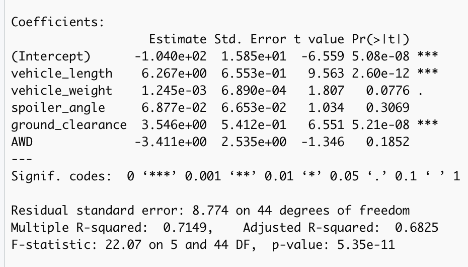
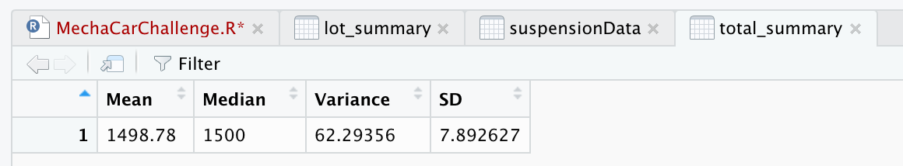
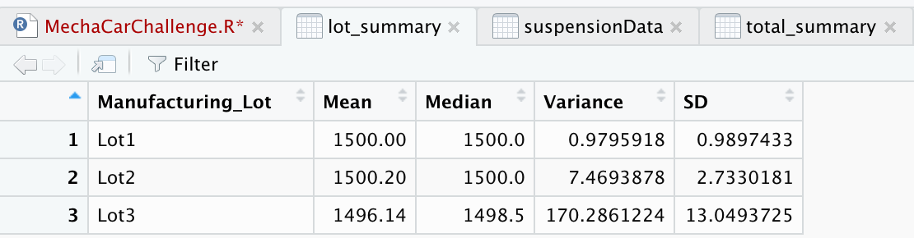
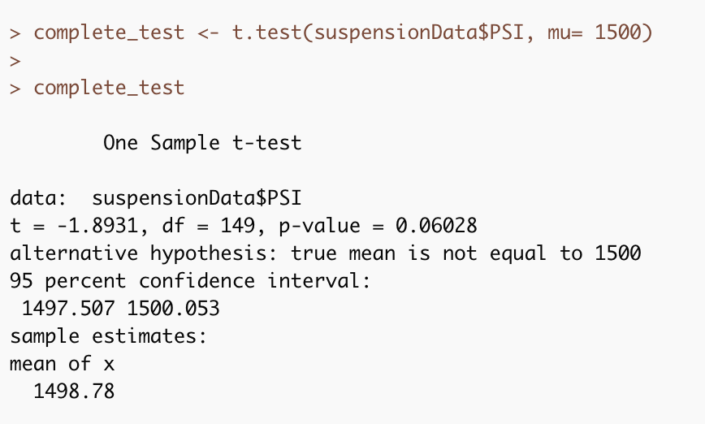
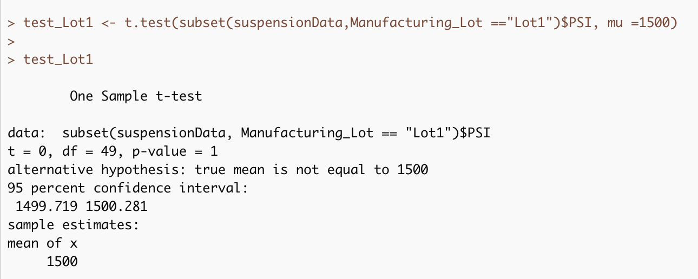
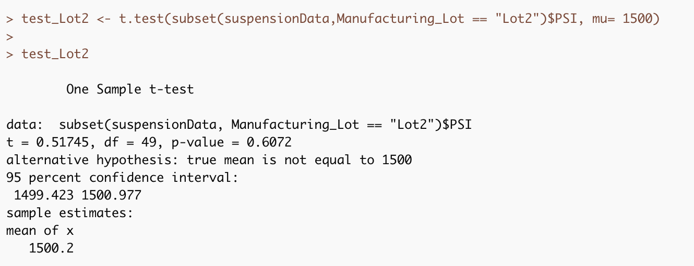
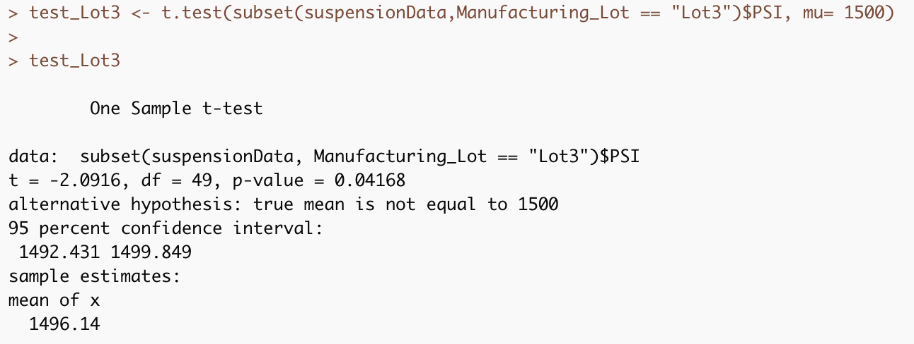

# MechaCar_Statistical_Analysis

## Linear Regression to Predict MPG

- Which variables/coefficients provided a non-random amount of variance to the mpg values in the dataset?
vehicle_lenght, ground_clearance and the intercept have p-values significantly below an alfa of 0.05, which means these are statistically unlikely to provide random amounts of variance to the linear model.

- Is the slope of the linear model considered to be zero? Why or why not?

No, the slope is 0 if none of the variables are statistically significant to the model. Since there are at least 2 that are statistically significant the null hypothesis (slope=0) must be rejected.

- Does this linear model predict mpg of MechaCar prototypes effectively? Why or why not?

Using the coefficient of determination (r^2 = 0.714) as a metric, we can see that this model is average to mediocre. While it is a start, there is much room for improvement.

## Summary Statistics on Suspension Coils

- The design specifications for the MechaCar suspension coils dictate that the variance of the suspension coils must not exceed 100 pounds per square inch. Does the current manufacturing data meet this design specification for all manufacturing lots in total and each lot individually? Why or why not?

The variance for the whole production does in fact comply with the specification as seen in the Total Summary table. However once the data is grouped by lots we can see that most variance comes from lot 3, with a staggering 170. In contrast lot 1 has a variance of 0.97, meaning it is the most stable of all.

## T-Tests on Suspension Coils

The summary of the T-Test is as follows: The mean of the entire table is not statistically different from the ideal mean of 1500, this is demonstrated by the first screenshot and the p-value of 0.06. However once each lot is analyzed separately we can see a few interesting results. Lots 1 and 2 follow the same trend as the general table, in fact the mean of Lot 1 is exactly 1500, hence the p-value of 1. In the case of Lot 3 there is a 95% confidence interval of the mean being between 1492 and 1499, and the p-value is equals to 0.41, which means it is statistically more likely that the difference in means is not random.

## Study Design: MechaCar vs Competition

- What metric or metrics are you going to test?

 fuel efficiency vs life of the vehicle

- What is the null hypothesis or alternative hypothesis?

Null: There is no relationship between the two variables

Alternative: There is a relationship

- What statistical test would you use to test the hypothesis? And why?

Linear regression, because I want to see if the independant variable (life of the vehicle) has any effect on the dependant variable (fuel efficiency), and if it does I want to be able to predict it.

- What data is needed to run the statistical test?

Fuel efficiency of several of the MechaCars paired with how much time they have been in service. 

